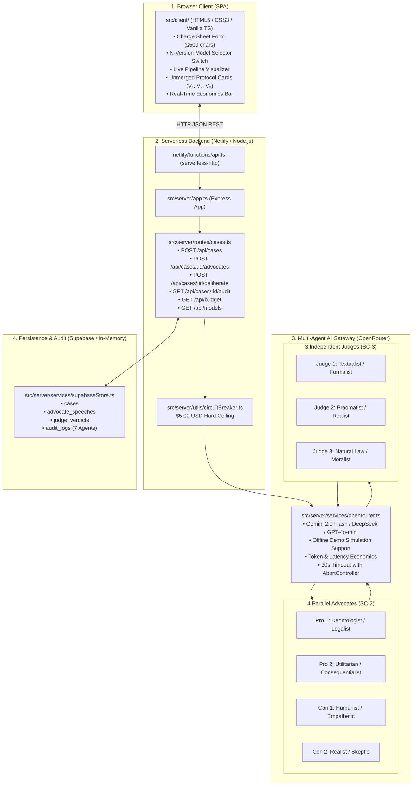

# ⚖️ The Tribunal — Multi-Agent Adversarial Deliberation System

> **Agentic Software Engineering Capstone Project**  
> Built strictly under the **[AGENTS.md](AGENTS.md)** Operating Contract using Test-Driven Development (TDD), Verification Gates, and Multi-Agent Orchestration.

[](tsconfig.json)
[](tests/)
[](tests/)
[](src/server/utils/circuitBreaker.ts)
[](scripts/verify-course-compliance.mjs)
[](netlify.toml)

---

## 1. Problem Statement & Philosophy

Single-agent LLM systems suffer from inherent **sycophancy**, overconfidence, and an inability to represent multi-faceted dialectical tension when evaluating complex ethical, legal, or policy dilemmas.

**The Tribunal** replaces single-agent answers with a structured **7-Agent Multi-Stage Pipeline**:
1. **Adversarial Phase:** 4 parallel advocates (2 Pro, 2 Con) formulate distinct legal-philosophical arguments.
2. **Adjudication Phase:** 3 independent judges deliberate across distinct jurisprudence schools.
3. **Unmerged Protocol ($V_1, V_2, V_3$):** Unlike naive ensemble models that average or synthesize opinions into a false consensus, The Tribunal presents all three independent rulings alongside identified points of dissent and tension.

---

## 2. 4-Layer Architecture



---

## 3. Multi-Agent Pipeline & Personas

### A. The 4 Advocates (SC-2)
* **Pro 1 (The Deontologist / Legalist):** Kantian duty, statutory formalism, categorical rules, and moral order.
* **Pro 2 (The Utilitarian / Consequentialist):** Aggregate societal utility, negative externalities, and future deterrence.
* **Con 1 (The Humanist / Empathetic):** Individual vulnerability, extenuating context, compassion, and human rights.
* **Con 2 (The Realist / Skeptic):** Institutional critique, jurisdiction challenges, systemic biases, and dangerous precedents.

### B. The 3 Judges & Unmerged Protocol (SC-3)
* **Judge 1 (The Textualist / Formalist):** Strict statutory construction, procedural integrity, and standard burden of proof.
* **Judge 2 (The Pragmatist / Realist):** Practical societal consequences, public interest, and institutional stability.
* **Judge 3 (The Natural Law / Moralist):** Universal human dignity, fundamental conscience, and substantive meta-legal justice.
* **Mitigation P1 (Robust Verdict Parser):** Mandates JSON output schema while supporting fallback regex extraction for non-compliant model responses.

### C. Security & Anti-Prompt-Injection
* **Boundary Isolation:** System Prompts are maintained strictly on the server.
* **XML Escaping:** All user-supplied fields (`defendant`, `act`, `question`) and advocate speeches are sanitized and wrapped in structured XML tags (`<charge_sheet>`, `<advocate_arguments>`), instructing agents to treat content solely as evidence.

---

## 4. Course Compliance Matrix (SC-1 to SC-6)

| Success Criterion | Requirement Description | Implementation Files | Verification Test Suites |
|---|---|---|---|
| **SC-1** | **Charge Sheet Validation** (Trim, $\le$ 500 chars, 201 UUID / 400 field errors) | [`src/server/validators/chargeSheet.ts`](src/server/validators/chargeSheet.ts) | [`tests/unit/chargeSheet.test.ts`](tests/unit/chargeSheet.test.ts)<br>[`tests/integration/casesRoute.test.ts`](tests/integration/casesRoute.test.ts) |
| **SC-2** | **4 Parallel Advocates** (2 Pro, 2 Con distinct personas, $P_{\text{all}}$ latency) | [`src/server/prompts/advocates.ts`](src/server/prompts/advocates.ts)<br>[`src/server/services/advocatesOrchestrator.ts`](src/server/services/advocatesOrchestrator.ts) | [`tests/unit/advocates.test.ts`](tests/unit/advocates.test.ts)<br>[`tests/integration/advocatesRoute.test.ts`](tests/integration/advocatesRoute.test.ts) |
| **SC-3** | **3 Independent Judges & Unmerged Protocol** ($V_1, V_2, V_3$ separate rulings) | [`src/server/prompts/judges.ts`](src/server/prompts/judges.ts)<br>[`src/server/services/judgesOrchestrator.ts`](src/server/services/judgesOrchestrator.ts)<br>[`src/server/utils/verdictParser.ts`](src/server/utils/verdictParser.ts) | [`tests/unit/judges.test.ts`](tests/unit/judges.test.ts)<br>[`tests/integration/deliberationRoute.test.ts`](tests/integration/deliberationRoute.test.ts) |
| **SC-4** | **Audit Trail & $5.00 Circuit Breaker** (Token tracking, cost, hard limit) | [`src/server/utils/circuitBreaker.ts`](src/server/utils/circuitBreaker.ts)<br>[`src/server/services/supabaseStore.ts`](src/server/services/supabaseStore.ts) | [`tests/unit/circuitBreaker.test.ts`](tests/unit/circuitBreaker.test.ts)<br>[`tests/unit/auditTrail.test.ts`](tests/unit/auditTrail.test.ts)<br>[`tests/integration/auditRoute.test.ts`](tests/integration/auditRoute.test.ts) |
| **SC-5** | **N-Version Model Diversity** (Uniform vs Diverse per-agent model assignment) | [`src/client/js/app.js`](src/client/js/app.js)<br>[`src/server/app.ts`](src/server/app.ts) | [`tests/integration/fullPipeline.test.ts`](tests/integration/fullPipeline.test.ts) |
| **SC-6** | **E2E Pipeline & Finiteness** (Complete 7-agent execution under 60 seconds) | [`src/server/routes/cases.ts`](src/server/routes/cases.ts) | [`tests/integration/fullPipeline.test.ts`](tests/integration/fullPipeline.test.ts) |

---

## 5. Verification Gates & Test Evidence

The repository strictly enforces automated quality gates before every commit via Husky:

```bash
npm run verify
# Executes: npm run lint && npm run build && npm test && npm run test:int

# Automated course scorecard audit
npm run verify:compliance
```

### Test Suite Summary (79 Tests Passing):
* **Unit Tests (59 tests):**
  * `tests/unit/chargeSheet.test.ts` (14 tests) — SC-1 validation contracts
  * `tests/unit/advocates.test.ts` (10 tests) — SC-2 personas & prompt injection
  * `tests/unit/judges.test.ts` (13 tests) — SC-3 unmerged protocol & JSON parsing
  * `tests/unit/circuitBreaker.test.ts` (6 tests) — $5.00 budget ceiling enforcement
  * `tests/unit/auditTrail.test.ts` (7 tests) — 7-agent persistence & metrics
  * `tests/unit/openrouter.test.ts` (6 tests) — API Gateway, offline simulation, timeouts, pricing
  * `tests/unit/serverlessHandler.test.ts` (3 tests) — Netlify Lambda execution
* **Integration Tests (20 tests):**
  * `tests/integration/casesRoute.test.ts` (5 tests) — POST /api/cases
  * `tests/integration/advocatesRoute.test.ts` (3 tests) — POST /api/cases/:id/advocates
  * `tests/integration/deliberationRoute.test.ts` (4 tests) — POST /api/cases/:id/deliberate
  * `tests/integration/auditRoute.test.ts` (4 tests) — GET /api/cases/:id/audit & GET /api/budget
  * `tests/integration/fullPipeline.test.ts` (3 tests) — Full 7-agent E2E flow < 60s
  * `tests/integration/health.test.ts` (1 test) — GET /health

---

## 6. Quick Start & Local Run

### Prerequisites
* Node.js $\ge$ 20 LTS
* npm $\ge$ 10

### 1. Clone & Install
```bash
git clone https://github.com/Amityst12/LLM-Project-AmitYehoshaphat.git
cd LLM-Project-AmitYehoshaphat
npm install
```

### 2. Environment Setup
```bash
cp .env.example .env
# Edit .env and set your OPENROUTER_API_KEY (optional: SUPABASE_URL / SUPABASE_KEY)
```

### 3. Run Locally
```bash
# Start development server
npm run dev

# Open in browser: http://localhost:3000
```

### 4. Run Quality Verification
```bash
npm run verify
```

---

## 7. Netlify Serverless Deployment

1. Connect repository `Amityst12/LLM-Project-AmitYehoshaphat` to **Netlify**.
2. Configure Environment Variables in Netlify Dashboard:
   * `OPENROUTER_API_KEY`: Your OpenRouter API key
   * `SUPABASE_URL` (optional): Your Supabase project URL
   * `SUPABASE_KEY` (optional): Your Supabase service role / anon key
3. Netlify automatically reads [`netlify.toml`](netlify.toml), builds the TypeScript backend (`npm run build`), hosts the frontend from `src/client`, and deploys the serverless API function from `netlify/functions/api.ts`.

---

## 8. Operating Contract & Project Rules

For full rules governing atomic commits, code conventions, secret scanning, and Definition of Done, see **[AGENTS.md](AGENTS.md)**.
